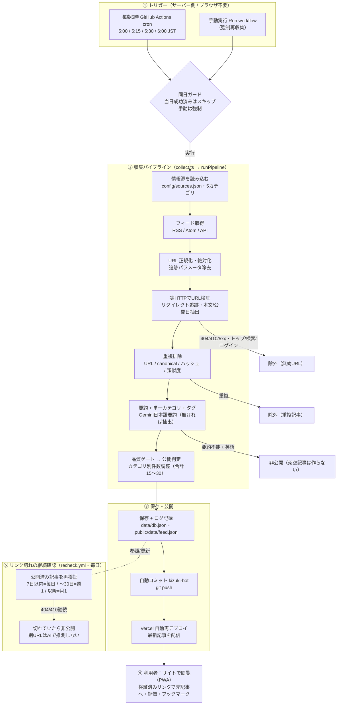

# きづき 全体フロー

実在記事を毎朝自動収集し、検証・要約してサイトに配信するまでの流れ。

## 各段階の要点

1. **トリガー**：収集は GitHub Actions（クラウド）で実行するため、利用者がブラウザ／PWAを閉じていても毎朝5時に動く。失敗時は 7:15/7:30/8:00 に再試行。手動実行は `force` で当日でも再収集。
2. **収集パイプライン**：有効な情報源ごとにフィードを取得し、URLを正規化してから**実際にHTTPアクセスして検証**（リダイレクト追跡、404/410/5xx・トップ/検索/ログインページの除外、タイトル・本文・公開日の抽出）。重複を除いたうえで、本文の事実だけを使った日本語要約と単一カテゴリ・タグを付与。品質基準を満たしたものだけ公開。
3. **保存・公開**：`data/db.json` と `public/data/feed.json`、収集ログを更新し、bot が自動コミット。push をトリガーに Vercel が再デプロイして最新記事を配信。
4. **利用者**：検証済みリンクからのみ元記事を開ける。評価・ブックマーク・カテゴリ絞り込みが可能。
5. **リンク切れ確認**：公開後も経過日数に応じて再検証。切れた記事は非公開にし、フィードから除外（別URLをAIで推測して差し替えない）。

## 「架空記事を作らない」ための要点
- URLは必ず実アクセスして存在確認。トップ／検索／ログイン／エラーページは記事として扱わない。
- 要約は元記事本文の事実のみ。取得できなければ生成せず非公開。
- 取得失敗時も前回の有効記事を表示し、架空記事で埋めない。
- APIキーは環境変数のみ（db.json・ブラウザに出さない）。
